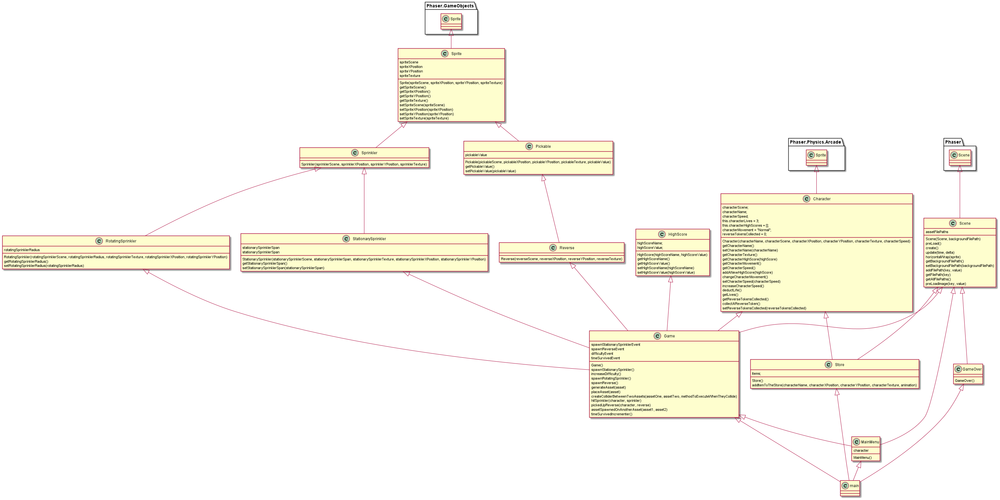

# Start Document Sprinkler Run

## Version History

|Version|Change|Date|
|-------|------|----|
|0.1|Document Creation|26-05-2021|
|0.2|Added What is Sprinkler Run|28-05-2021|
|0.3|Added the controls|01-06-2021|
|0.4|Added the class diagram|04-06-2021|
|0.5|Added the new class diagram|16-06-2021|
|0.5|Modified the idea as it was unrealistic|17-06-2021|

## What is Sprinkler Run?
Sprinkler Run is a 2D infinite runner game designed to be run on your favorite web browser. You might be asking your self what is an infinite runner? don"t you worry it"s all explained in the text below.

### What is an Infinite Runner?

If you know what an infinite runner is please skip to the idea. If you don"t let me enlighten you. 
An infinite runner is a style of a platform game in which the character runs non-stop through a hazardous course, and must be guided to jum, duck, etc. to avoid the hazards.

### The Idea

The game will be based upon a character running through a field with a series of randomly generated sprinklers that the player must avoid in order to progress. If by any means the player runs into or is hit by a sprinkler a life will be deducted, once the player looses three lives the game over screen will be displayed showing the total time survived and tokens collected. If the player happens to be talented they may experience an increase in pace of the game, well this is because more sprinklers spawn including spinning ones. Now you might be telling your self that is too simple, so I have added a little of spice here goes nothing. The game will not only be made up of one character, you will be able to change your character in the store which will then change how the game looks.

## Class Diagram

## Requested Additions

As requested by the lecture I will be adding an item that when picked up flips the controls. This means that when the player presses left the character will move right and when the player presses right the character will move left.
