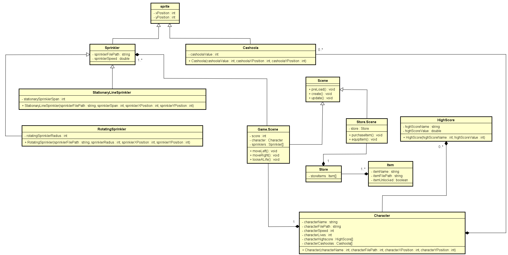

# Start Document Sprinkler Run

## Version History

|Version|Change|Date|
|-------|------|----|
|0.1|Document Creation|26-05-2021|
|0.2|Added What is Sprinkler Run|28-05-2021|
|0.3|Added the controls|01-06-2021|
|0.4|Added the class diagram|04-06-2021|

## What is Sprinkler Run?
Sprinkler Run is a 2D infinite runner game designed to be run on you favorite web browser. You might be asking your self what is an infinite runner? don't you worry it's all explained in the text below.

### What is an Infinite Runner?

If you know what an infinite runner is please skip to the idea. If you don't let me enlighten you. 
An infinite runner is a style of a platform game in which the character runs non-stop through a hazardous course, and must be guided to jum, duck, etc. to avoid the hazards.

### The Idea

The game will be based upon a character running through a field with a series of randomly generated sprinklers that the player must avoid in order to progress. If by any means the player runs into or is hit by a sprinkler a life will be deducted, once the player looses three lives the game over screen will be displayed showing the total distance travelled, time survived, sprinklers dodges, and the players high score. If the player happens to be talented and lives past the first thirty seconds the speed of the game will increase, this will continue to happen every thirty seconds until the player reaches zero lives. Now you might be telling your self that is too simple, so I have added a little of spice here goes nothing. The game will not only be made up of one character or one sprinkler or one background, you will be able to purchase cosmetic upgrades in the store which will then change how the game looks. Now how can one get the cashoola to purchase these items? duh, by collecting randomly generated cashoola whilst playing the game. Not every cashoola will be of the same value because that would be boring so to reward staying alive for a longer period of time higher value cashoola will be awarded to the player. If the player is extremely talented and happens to live past 60 seconds the sprinklers will start to rotate just like they would in real life, as well as the speed increase as the player progresses.

## Controls

The controls for Sprinkler Run are quite basic but nevertheless they are as follows: 

* In the menu the player will be able to use the mouse pointer in order to select what they want.
* Whilst playing the game the player will be able to manipulate the characters' movement by pressing the left and right arrow keys in order to dodge the sprinklers and collect the cashoola.
* There are a couple of Easter eggs in the controls I challenge you to find them I will give you a hit smash your keyboard but that is only one try to find the rest.

## Class Diagram

## Requested Additions

As requested by the lecture I will be adding an item that when picked up flips the controls. This means that when the player presses left the character will move right and when the player presses right the character will move left.
